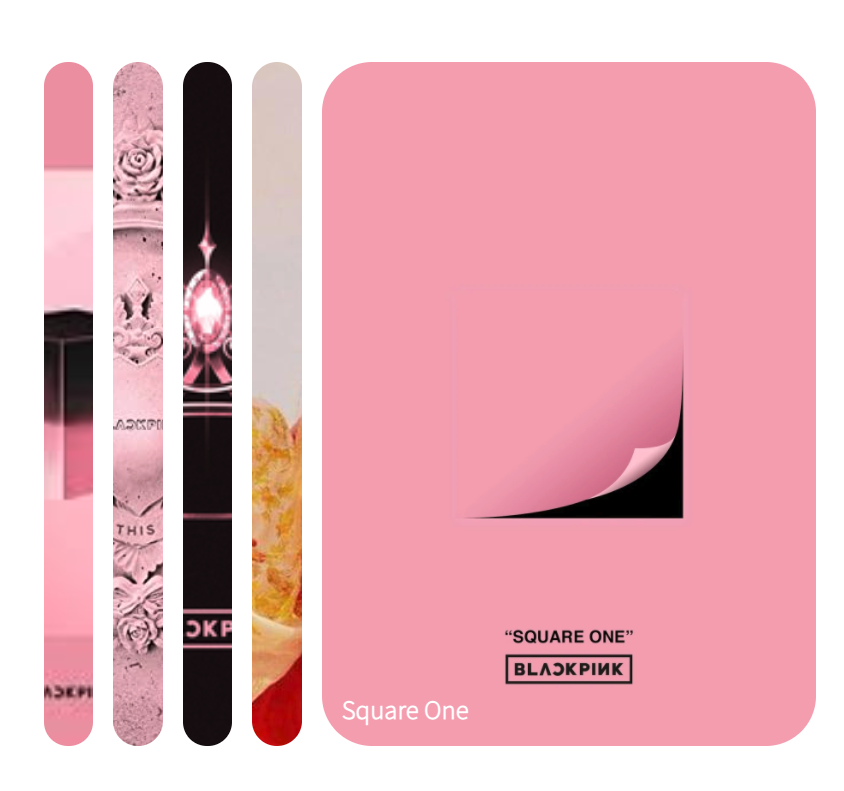
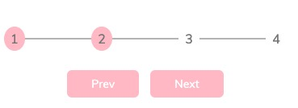
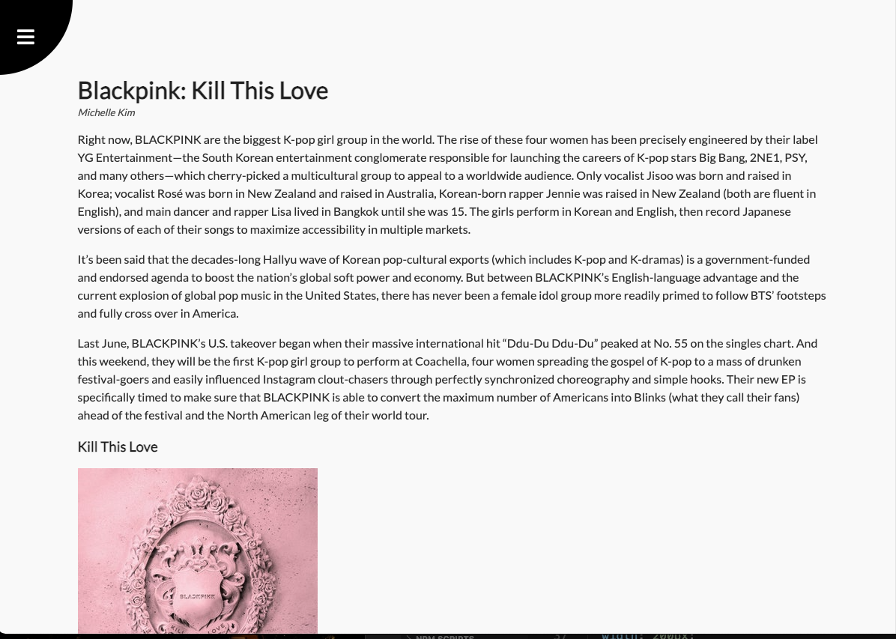

# mini_project
 
small projects with practicing differnt functions will fun!

#1

expand_image:
- when clicking on the picture, the picture will expand for viewing

steps:
- when clicking on the prev/next button, the circle will continue to previous/next step

rotating_navigation:
- when clicking the navigation bar, the page will rotate to show the menu bar

